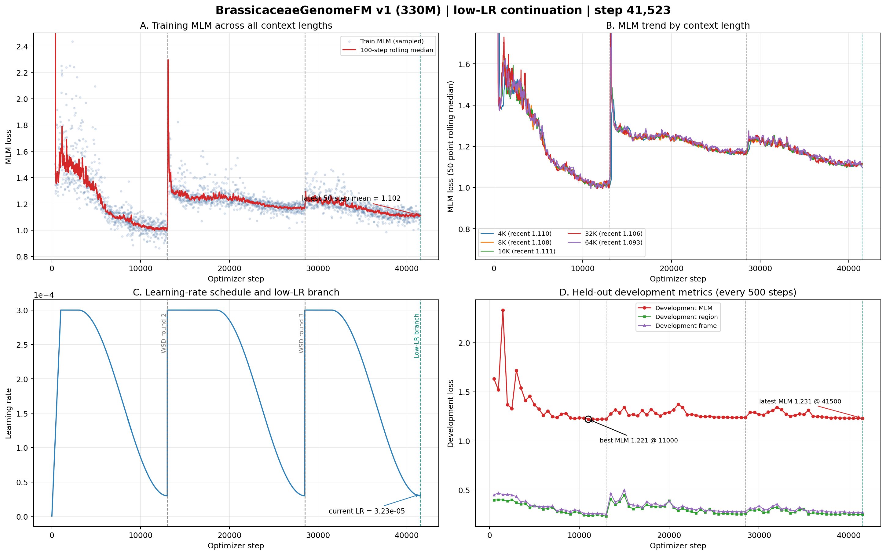

# BrassicaceaeGenomeFM — 十字花科基因组基础模型

## 当前状态

| 项目 | 状态 |
|------|------|
| 模型 | BrassiCaduceus ~330M（Bi-Mamba2 + tied embedding） |
| 训练 | **已按新策略重启** — 从 step 41,500 分支，旧高学习率运行停在 step 44,307 |
| 上下文 | 4K / 8K / 16K / 32K / 64K（128K 因 40GB 显存上限未纳入 v1） |
| 新学习率 | 当前 3.23e-5；500步平滑升至8e-5，稳定1,000步，再单向余弦降至1e-5；禁自动重启 |
| 开发集 MLM | 新分支尚未到首次评估；父 checkpoint 为1.231（step 41,500），全程最佳1.221（step 11,000） |
| 活跃语料覆盖 | 326.5 亿 / 1142 亿唯一 tokens（28.6%）；cycle 0、无受控复用 |
| Checkpoint | 父 checkpoint step 41,500；新 lineage 首个永久 checkpoint 将在 step 42,000 保存 |
| GPU | gpu10 的 GPU 0/1/2，均为 A100 40GB，当前 100% 利用率 |
| CPU Gate | 323/323 tests PASSED；新 lineage 专属 Gate 已通过 |
| 下游任务 | 32 项任务体系，12 个数据 release 已冻结（521,204 样本） |
| 公共基线 | 14 个公共 DNA-FM 权重就位于 `~/myhermes/down_model` |

## 关键参数

- 架构：21层 Bi-Mamba2, d_model=768, d_state=128, group_size=6
- 并行：FSDP (FULL_SHARD), 3 GPU, world_size=3
- 精度：bfloat16 参数+激活, float32 残差累积
- 优化器：AdamW, peak lr=3e-4, warmup=1000 steps, WSD schedule
- 每 step token 数：786,432
- gradient_accumulation=4, per_rank microbatch: 16/8/4/2/1 (4K→64K)
- RC 仅在 4K–64K 启用, fraction=0.05

## 损失函数

| 损失 | 权重 | 说明 |
|------|------|------|
| MLM | 1.0 | 15% 掩码, span+singleton |
| Region | 0.25 | 9类基因组区域分类 |
| Frame | 0.1 | 6-frame ORF 检测 |
| Boundary | 0.1 | 区域边界 token 检测 |
| RC | 0.05 | 反向互补一致性 |
| Homeolog | 0.05 | 同源基因对 InfoNCE |

## 产物路径

- 活跃训练日志：`workspace/formal_runs/brassicaceae_330m_low_lr_from_step41500_v1/training.jsonl`
- 活跃 checkpoint：`workspace/formal_runs/brassicaceae_330m_low_lr_from_step41500_v1/checkpoints/step_NNN/`
- 父 checkpoint：`workspace/formal_runs/brassicaceae_330m_formal_v1/checkpoints/step_000000041500/`
- 训练曲线：`docs/brassicaceae_genomefm_v1_training_curves_step*.png/pdf`（最新随提交更新）

## 训练进度（低学习率分支快照至 step 41,523）



### 白话解读

**A. 全部上下文的训练 MLM（左上）**
横轴是优化器步数，纵轴是 MLM loss。图只保留当前有效 lineage：旧运行保留到被选中的 step 41,500，之后接上新低学习率分支；旧运行 step 41,501–44,307 已明确废弃，不混入当前曲线。新分支刚开始，训练点连续且 loss 位于父 checkpoint 的正常区间，暂不对23个新步作泛化结论。

**B. 五档上下文（右上）**
五条线分别对应4K、8K、16K、32K、64K。当前曲线在绿色分支线处连续，没有出现某一长度突然失稳；但新分支样本太少，最近50点仍主要来自父运行末段，需等待更多新步后再比较各上下文。

**C. 多轮 WSD 学习率（左下）**
灰色虚线是旧 WSD 轮次，绿色虚线是新的低学习率分支。step 41,500 的旧 WSD 末端学习率为3e-5；新分支从该值平滑起步，step 41,501–41,523 从3.01e-5升到3.23e-5，没有再跳回3e-4。计划在 step 42,000 到达8e-5，稳定至43,000，再单向余弦衰减到 step 53,000 的1e-5，之后保持1e-5，不再自动重启。

**D. 开发集（右下）**
新分支继承父 checkpoint step 41,500 的开发集 MLM 1.231；全程最佳仍是 step 11,000 的1.221。新分支首次固定开发集评估将在 step 42,000 产生，因此现在只能确认恢复和学习率正确，尚不能宣称新策略改善了泛化。

### 当前判断

- **停止与恢复已闭环**：旧运行精确停止，三卡释放；新 lineage 从完整的 step 41,500 模型、优化器、sampler和三份rank RNG恢复。
- **运行层面健康**：新分支已连续通过至少10个优化器步；三个rank分别绑定GPU 0/1/2，三卡100%，学习率逐步值与合同逐步一致。
- **科学判断保持待验证**：新策略解决了“每轮跳回3e-4”的工程问题，但是否改善开发集要等 step 42,000 及后续评估；不能用当前短训练段提前下结论。

- CPU Gate：`workspace/release/formal_cpu_gate_low_lr_from_step41500_v1/`

## 启动命令

```bash
cd /home/user/zhangzhishuai/myhermes/Brassicaceae_genomemodel
CUDA_VISIBLE_DEVICES=0,1,2 PYTHONPATH=workspace/code \
python workspace/code/formal_launcher.py \
  --run-contract workspace/config/formal_run_low_lr_from_step41500_v1.json \
  --checkpoint-group-size 6 \
  --distributed-mode fsdp \
  --resume workspace/formal_runs/brassicaceae_330m_formal_v1/checkpoints/step_000000041500 \
  --authorize-gpu-launch I_AUTHORIZE_3XA100_FORMAL_TRAINING
```

## 训练集

- 66个十字花科 genome assembly
- 不含放回抽样, cycle 0
- cluster-aware split (train/development)
- 5个上下文长度的 token 比例: 4K=10%, 8K=20%, 16K=21%, 32K=27%, 64K=22%
