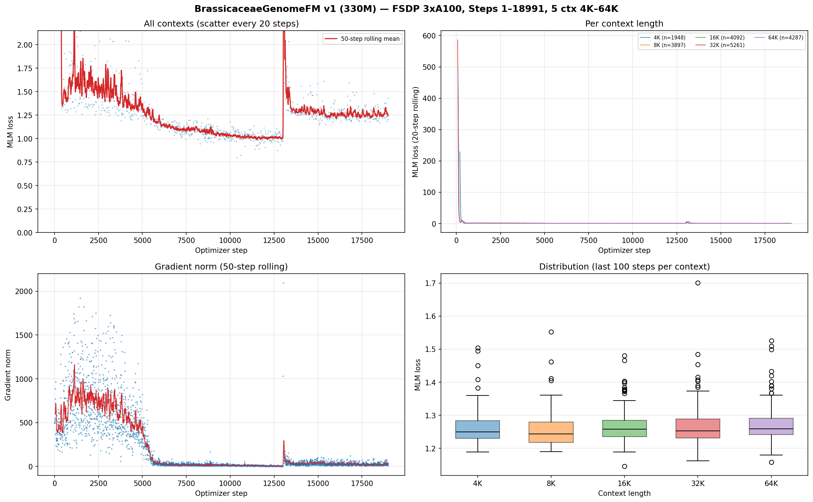

# BrassicaceaeGenomeFM — 十字花科基因组基础模型

## 当前状态

| 项目 | 状态 |
|------|------|
| 模型 | BrassiCaduceus ~330M (Bi-Mamba2 + tied embedding) |
| 训练 | **进行中** — step 19,000+，第二轮 WSD 已开始（LR 回到峰值） |
| 上下文 | 4K / 8K / 16K / 32K / 64K (128K 待更多显存) |
| MLM loss | 历史最低 0.722（64K 上下文），当前轮 50 步均值 1.249 |
| 开发集 MLM | 1.25–1.32 区间，第一轮末小幅回升、第二轮开始后回落 |
| 语料消耗 | 149.6 亿 / 1142 亿 tokens（13.1%，第一轮不放回仅用一小部分） |
| Checkpoint | 每 500 step 永久保存，已存 38 个（最新 step 19000） |
| GPU 节点 | ibgpu10 (12.12.12.210), GPU 0/1/2 |
| CPU Gate | 313/313 tests PASSED |
| 下游任务 | 32 项任务体系，12 个数据 release 已冻结（521,204 样本） |
| 公共基线 | 14 个公共 DNA-FM 权重就位于 ~/myhermes/down_model |

## 关键参数

- 架构：21层 Bi-Mamba2, d_model=768, d_state=128, group_size=6
- 并行：FSDP (FULL_SHARD), 3 GPU, world_size=3
- 精度：bfloat16 参数+激活, float32 残差累积
- 优化器：AdamW, peak lr=3e-4, warmup=1000 steps, WSD schedule
- 每 step token 数：786,432
- gradient_accumulation=4, per_rank microbatch: 16/8/4/2/1 (4K→64K)
- RC 仅在 4K–64K 启用, fraction=0.05

## 损失函数

| 损失 | 权重 | 说明 |
|------|------|------|
| MLM | 1.0 | 15% 掩码, span+singleton |
| Region | 0.25 | 9类基因组区域分类 |
| Frame | 0.1 | 6-frame ORF 检测 |
| Boundary | 0.1 | 区域边界 token 检测 |
| RC | 0.05 | 反向互补一致性 |
| Homeolog | 0.05 | 同源基因对 InfoNCE |

## 产物路径

- 训练日志：`workspace/formal_runs/brassicaceae_330m_formal_v1/training.jsonl`
- Checkpoint：`workspace/formal_runs/brassicaceae_330m_formal_v1/checkpoints/step_NNN/`
- 训练曲线：`docs/brassicaceae_genomefm_v1_training_curves_step*.png/pdf`（最新随提交更新）

## 训练进度（更新至 step 18991）



### 白话解读

**这张图怎么看**：上图是训练损失，纵轴越低越好；下左是学习率，下右是开发集 MLM。

**发生了什么**：
1. 第一轮（step 0–13900）：5 档上下文（4K–64K）的 MLM 损失一路下降，训练集最低到 0.72（64K 上下文最能"读懂"长序列），开发集 MLM 同步降到 1.23 附近——模型确实在学会十字花科基因组语言，而不是死记硬背。
2. 学习率按 WSD 计划从峰值 3e-4 衰减到接近 0（step ~13900 处），第一轮结束。
3. 第二轮（step 13900+，当前）：学习率自动跳回峰值重开一轮，训练损失小幅回升后重新下行（预期行为——新学习率周期的起步震荡），开发集 MLM 也从 1.32 回落到 1.25。

**当前结论**：模型在学，无过拟合证据（开发集没有恶化），语料第一轮只用了 13%，还有 87% 的新数据留给后续轮次。每 500 步一个永久 checkpoint，随时可选点做下游评测。

**不能说明什么**：MLM 损失低不代表下游任务必然好——最终结论要等 12 个下游 release 的评测结果。
- CPU Gate：`workspace/release/formal_cpu_gate_v1/`

## 启动命令

```bash
cd /home/user/zhangzhishuai/myhermes/Brassicaceae_genomemodel
CUDA_VISIBLE_DEVICES=0,1,2 PYTHONPATH=workspace/code \
python workspace/code/formal_launcher.py \
  --run-contract workspace/config/formal_run_v1.json \
  --checkpoint-group-size 6 \
  --distributed-mode fsdp \
  --authorize-gpu-launch I_AUTHORIZE_3XA100_FORMAL_TRAINING
```

## 训练集

- 66个十字花科 genome assembly
- 不含放回抽样, cycle 0
- cluster-aware split (train/development)
- 5个上下文长度的 token 比例: 4K=10%, 8K=20%, 16K=21%, 32K=27%, 64K=22%
