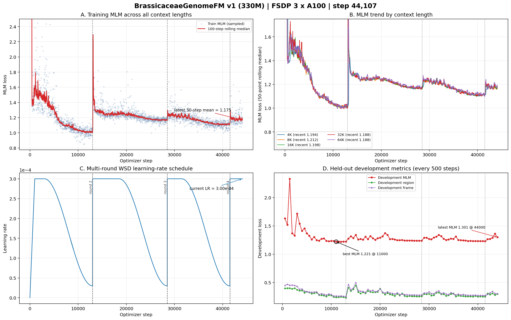

# BrassicaceaeGenomeFM — 十字花科基因组基础模型

## 当前状态

| 项目 | 状态 |
|------|------|
| 模型 | BrassiCaduceus ~330M（Bi-Mamba2 + tied embedding） |
| 训练 | **进行中** — 快照 step 44,107，第四轮 WSD 已于 step 41,500 启动 |
| 上下文 | 4K / 8K / 16K / 32K / 64K（128K 因 40GB 显存上限未纳入 v1） |
| 训练 MLM | 最近 50 步均值 1.175；历史单步最低 0.722（64K） |
| 开发集 MLM | 最新 1.301（step 44,000）；全程最佳 1.221（step 11,000） |
| 语料覆盖 | 346.8 亿 / 1142 亿唯一 tokens（30.4%）；仍为 cycle 0、无受控复用 |
| Checkpoint | 每 500 step 永久保存；88 个，最新 step 44,000 |
| GPU | gpu10 的 GPU 0/1/2，均为 A100 40GB，当前 100% 利用率 |
| CPU Gate | 313/313 tests PASSED |
| 下游任务 | 32 项任务体系，12 个数据 release 已冻结（521,204 样本） |
| 公共基线 | 14 个公共 DNA-FM 权重就位于 `~/myhermes/down_model` |

## 关键参数

- 架构：21层 Bi-Mamba2, d_model=768, d_state=128, group_size=6
- 并行：FSDP (FULL_SHARD), 3 GPU, world_size=3
- 精度：bfloat16 参数+激活, float32 残差累积
- 优化器：AdamW, peak lr=3e-4, warmup=1000 steps, WSD schedule
- 每 step token 数：786,432
- gradient_accumulation=4, per_rank microbatch: 16/8/4/2/1 (4K→64K)
- RC 仅在 4K–64K 启用, fraction=0.05

## 损失函数

| 损失 | 权重 | 说明 |
|------|------|------|
| MLM | 1.0 | 15% 掩码, span+singleton |
| Region | 0.25 | 9类基因组区域分类 |
| Frame | 0.1 | 6-frame ORF 检测 |
| Boundary | 0.1 | 区域边界 token 检测 |
| RC | 0.05 | 反向互补一致性 |
| Homeolog | 0.05 | 同源基因对 InfoNCE |

## 产物路径

- 训练日志：`workspace/formal_runs/brassicaceae_330m_formal_v1/training.jsonl`
- Checkpoint：`workspace/formal_runs/brassicaceae_330m_formal_v1/checkpoints/step_NNN/`
- 训练曲线：`docs/brassicaceae_genomefm_v1_training_curves_step*.png/pdf`（最新随提交更新）

## 训练进度（快照至 step 44,107）



### 白话解读

**A. 全部上下文的训练 MLM（左上）**
横轴是优化器步数，纵轴是 MLM loss（遮住一部分 DNA 后让模型猜回来，越低越好）。浅蓝点是抽样后的单步结果，红线是 100 步滚动中位数，虚线是 WSD 新一轮开始的位置。第三轮衰减末训练 loss 降至新低区间；第四轮在 step 41,500 把学习率重新升到峰值后再次短暂回升。当前最近 50 步均值为 1.175，较上次公开快照 step 32,787 的 1.196 继续改善。

**B. 五档上下文（右上）**
五条线分别对应 4K、8K、16K、32K、64K。最近 50 个各自训练点的均值依次为 1.194、1.212、1.198、1.188、1.188；32K 与 64K 当前最低，五档差距约 0.024，说明长上下文仍然稳定，没有出现长度越长越差。局限是各档微批次不同，单步噪声和绝对 loss 不能直接等价为下游能力。

**C. 多轮 WSD 学习率（左下）**
WSD 分别在 step 13,000、28,500、41,500 自动开启第二、第三、第四轮，每次都把学习率恢复到 3e-4，没有停训或人工接续。当前第四轮仍处于 3e-4 峰值平台期。

**D. 开发集（右下）**
每 500 步在固定留出数据上评估一次。全程最佳开发集 MLM 仍是 1.221（step 11,000）。第三轮高学习率阶段一度恶化，但在衰减末恢复到 1.231（step 41,500），接近但没有超过全程最佳。第四轮重启后又从 1.266/1.269 升至 1.293/1.362，step 44,000 回落到 1.301。重复模式已经很清楚：**高学习率重启会损伤开发集，衰减阶段能恢复，但后续轮次尚未刷新开发集最佳值**。

### 当前判断

- **运行层面健康**：3×A100 持续满载，FSDP 三个 rank 存活，日志继续增长。
- **数据仍很充足**：已覆盖 346.8 亿 / 1142 亿唯一 tokens（30.4%），仍在首个无放回覆盖周期，受控复用为 0。
- **科学判断**：运行和训练拟合持续健康，但多轮 WSD 尚未把开发集最佳值从 step 11,000 往后推进，边际泛化收益没有得到证明。按开放式训练合同可继续观察第四轮衰减，但不能把最新 checkpoint 当成最好；应保留 step 11,000 和第三轮末 step 41,500 等候选，由冻结的 32 项下游评测最终决定。

- CPU Gate：`workspace/release/formal_cpu_gate_v1/`

## 启动命令

```bash
cd /home/user/zhangzhishuai/myhermes/Brassicaceae_genomemodel
CUDA_VISIBLE_DEVICES=0,1,2 PYTHONPATH=workspace/code \
python workspace/code/formal_launcher.py \
  --run-contract workspace/config/formal_run_v1.json \
  --checkpoint-group-size 6 \
  --distributed-mode fsdp \
  --authorize-gpu-launch I_AUTHORIZE_3XA100_FORMAL_TRAINING
```

## 训练集

- 66个十字花科 genome assembly
- 不含放回抽样, cycle 0
- cluster-aware split (train/development)
- 5个上下文长度的 token 比例: 4K=10%, 8K=20%, 16K=21%, 32K=27%, 64K=22%
