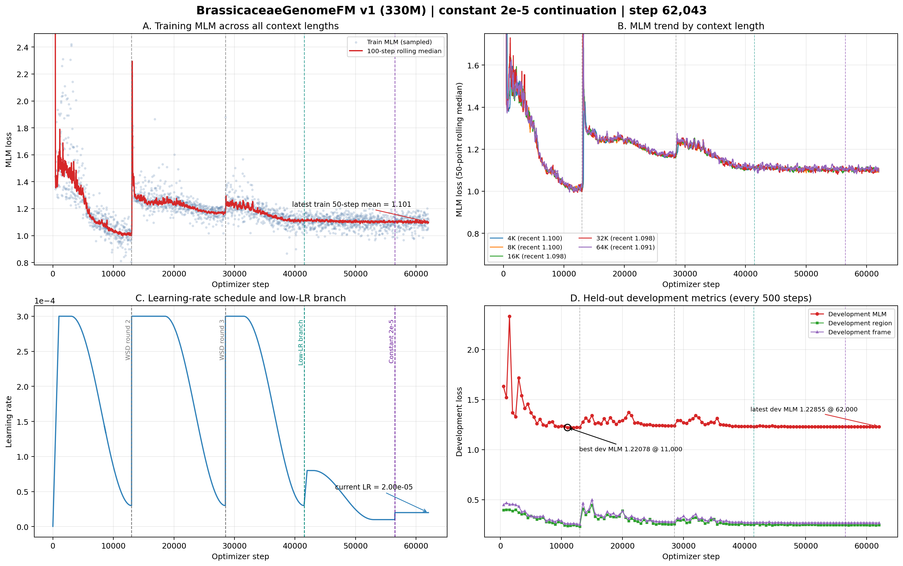

# BrassicaceaeGenomeFM — 十字花科基因组基础模型

## 当前状态

| 项目 | 状态 |
|------|------|
| 模型 | BrassiCaduceus ~330M（Bi-Mamba2 + tied embedding） |
| 训练 | **运行中** — 第三条lineage从step 56,500起恒定2e-5，快照至step 62,043 |
| 上下文 | 4K / 8K / 16K / 32K / 64K（128K 因40GB显存上限未纳入v1） |
| 新学习率 | 每一步恒定2e-5；无warmup、无衰减、无自动重启、无开发集变差回退 |
| 开发集 MLM | 最新1.22855（step 62,000）；恒定2e-5分支内最低，但全程最佳仍为1.22078（step 11,000） |
| 活跃语料覆盖 | 487.9亿 / 1142亿唯一tokens（42.7%）；cycle 0、无受控复用 |
| Checkpoint | 恒定2e-5新lineage已保存11个永久checkpoint，最新step 62,000；父checkpoint step 56,500保留 |
| GPU | gpu10的GPU 0/1/2，均为A100 40GB；快照时三卡100%，每卡约31–32GB |
| CPU Gate | 328/328 tests PASSED；恒定2e-5新lineage专属Gate已通过 |
| 下游任务 | 32项任务；其中6项已有12个冻结release（521,204样本），正式结果仍为0 |
| 当前可执行范围 | 冻结release可展开57次现有方法运行；完整864-cell矩阵仍有536项实现阻塞 |
| 公共基线 | 14个公共DNA-FM权重已就位；权重就位不等于适配器和正式评测完成 |

## 关键参数

- 架构：21层 Bi-Mamba2, d_model=768, d_state=128, group_size=6
- 并行：FSDP (FULL_SHARD), 3 GPU, world_size=3
- 精度：bfloat16 参数+激活, float32 残差累积
- 优化器：AdamW；历史阶段使用3e-4 WSD与单向低学习率退火，活跃lineage恒定2e-5
- 每 step token 数：786,432
- gradient_accumulation=4, per_rank microbatch: 16/8/4/2/1 (4K→64K)
- RC 仅在 4K–64K 启用, fraction=0.05

## 损失函数

| 损失 | 权重 | 说明 |
|------|------|------|
| MLM | 1.0 | 15% 掩码, span+singleton |
| Region | 0.25 | 9类基因组区域分类 |
| Frame | 0.1 | 6-frame ORF 检测 |
| Boundary | 0.1 | 区域边界 token 检测 |
| RC | 0.05 | 反向互补一致性 |
| Homeolog | 0.05 | 同源基因对 InfoNCE |

## 产物路径

- 活跃训练日志：`workspace/formal_runs/brassicaceae_330m_constant2e5_from_step56500_v1/training.jsonl`
- 活跃checkpoint：`workspace/formal_runs/brassicaceae_330m_constant2e5_from_step56500_v1/checkpoints/step_NNN/`
- 父checkpoint：`workspace/formal_runs/brassicaceae_330m_low_lr_from_step41500_v1/checkpoints/step_000000056500/`
- 上一分支checkpoint：`workspace/formal_runs/brassicaceae_330m_formal_v1/checkpoints/step_000000041500/`
- CPU Gate：`workspace/release/formal_cpu_gate_constant2e5_from_step56500_v1/`
- 训练曲线：`docs/brassicaceae_genomefm_v1_training_curves_step*.png/pdf`（最新随提交更新）

## 训练进度（恒定2e-5分支快照至step 62,043）



### 白话解读

**A. 全部上下文的训练 MLM（左上）**
恒定2e-5分支已从step 56,500连续运行5,543步，最近50步训练MLM均值1.101。训练曲线保持平滑，没有出现把学习率翻倍后的持续震荡或发散；单批MLM会随上下文和辅助标签组成正常波动。

**B. 五档上下文（右上）**
恒定2e-5分支最近50个各自上下文点约为4K 1.100、8K 1.100、16K 1.098、32K 1.098、64K 1.091；五档均保持稳定，没有长度选择性发散。

**C. 多轮 WSD 学习率（左下）**
绿色线是step 41,500的单向低学习率分支；紫色线是step 56,500的新恒定2e-5分支。新lineage从父checkpoint的1e-5直接切到2e-5，从step 56,501开始每一步都严格保持2e-5；没有warmup、衰减、自动重启或开发集触发回退。

**D. 开发集（右下）**
恒定2e-5分支已有11个固定开发集点。最新step 62,000为1.228552，较分支首点1.229066下降0.000513，也是该分支最低；它只比父低学习率平台的最低值1.228563低0.000011，差异极小。全程最佳仍是step 11,000的1.220776，因此当前只能说2e-5安全稳定、出现边缘改善，不能宣称泛化显著提升。

### 当前判断

- **运行层面健康**：恒定2e-5已连续运行5,543步，3个FSDP rank和三张A100保持满载，无失败、无复用。
- **分支内有边缘改善**：step 62,000形成恒定2e-5分支最低开发集MLM，但仅比父lineage最低值低约1.1e-5。
- **仍未超过全程最佳**：step 11,000的1.220776仍明显更低；按用户要求继续恒定2e-5，不设置自动降回1e-5。

## 下游评测状态

- Registry共32项任务、27种方法，完整矩阵为864个task×method单元：154个实现层面ready、536个blocked、174个not applicable。
- 只有P1/P3/P4/P8/P10/P13六项任务具备冻结数据，共12个release、521,204个样本；其余26项任务尚未冻结正式数据。
- 12个release按当前可用方法可展开57次真实运行；这些运行尚未启动，当前没有正式下游分数或排行榜。
- 14个公共DNA基础模型权重已统一保存在`~/myhermes/down_model`。多数公共模型适配器/真实forward闭环仍未完成，不能把“权重已下载”写成“公共基线已跑完”。
- BrassicaceaeGenomeFM的正式下游CPU合同为q03；下游GPU必须等用户指定执行卡，不占用当前三卡预训练任务。

## 当前项目判断

1. 预训练工程状态正常，可以继续恒定2e-5运行；训练是开放式计划，没有预设总step或自动结束点。
2. 2e-5尚未带来有科学意义的新开发集优势，最终模型不能只按最新step选择，仍需比较step 11,000、28,500、41,500、56,500及后续候选checkpoint的固定下游结果。
3. 项目最大的未完成部分已经从“能否稳定预训练”转为“补齐下游数据与公共模型适配，并在同split、同head预算下真实重跑”。
4. 当前GitHub只发布轻量状态、曲线和摘要；checkpoint、训练日志、原始数据与完整评测目录均不上传。

## 启动命令

```bash
cd /home/user/zhangzhishuai/myhermes/Brassicaceae_genomemodel
CUDA_VISIBLE_DEVICES=0,1,2 PYTHONPATH=workspace/code \
python workspace/code/formal_launcher.py \
  --run-contract workspace/config/formal_run_constant2e5_from_step56500_v1.json \
  --checkpoint-group-size 6 \
  --distributed-mode fsdp \
  --resume workspace/formal_runs/brassicaceae_330m_low_lr_from_step41500_v1/checkpoints/step_000000056500 \
  --authorize-gpu-launch I_AUTHORIZE_3XA100_FORMAL_TRAINING
```

## 训练集

- 66个十字花科 genome assembly
- 不含放回抽样, cycle 0
- cluster-aware split (train/development)
- 5个上下文长度的 token 比例: 4K=10%, 8K=20%, 16K=21%, 32K=27%, 64K=22%
