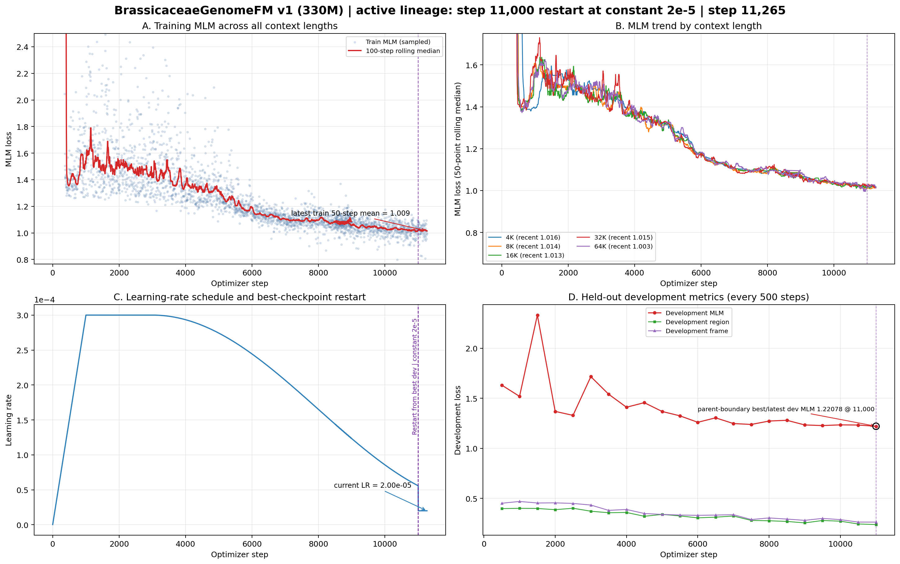

# BrassicaceaeGenomeFM — 十字花科基因组基础模型

## 当前状态

| 项目 | 状态 |
|------|------|
| 模型 | BrassiCaduceus ~330M（Bi-Mamba2 + tied embedding） |
| 训练 | **运行中** — 已回到全程最佳开发集checkpoint step 11,000，新分支快照至step 11,265 |
| 上下文 | 4K / 8K / 16K / 32K / 64K（128K 因40GB显存上限未纳入v1） |
| 新学习率 | 从step 11,001起每一步恒定2e-5；无warmup、无衰减、无自动重启、无开发集回退 |
| 开发集 MLM | 新分支尚无评估点；父边界step 11,000为1.22078，也是当前权威lineage最佳 |
| 活跃语料覆盖 | 88.6亿 / 1142亿唯一tokens（7.76%）；采样状态随checkpoint回退，cycle 0、无受控复用 |
| Checkpoint | 当前完整恢复点为父checkpoint step 11,000；首个新分支永久checkpoint将在step 11,500 |
| GPU | gpu10的GPU 0/1/2，均为A100 40GB；快照时三卡100%，每卡约31GB |
| CPU Gate | 333/333 tests PASSED；step 11,000新lineage专属r2 Gate和GPU acceptance均通过 |
| 下游任务 | 32项任务；其中6项已有12个冻结release（521,204样本），正式结果仍为0 |
| 当前可执行范围 | 冻结release可展开57次现有方法运行；完整864-cell矩阵仍有536项实现阻塞 |
| 公共基线 | 14个公共DNA-FM权重已就位；权重就位不等于适配器和正式评测完成 |

## 关键参数

- 架构：21层 Bi-Mamba2, d_model=768, d_state=128, group_size=6
- 并行：FSDP (FULL_SHARD), 3 GPU, world_size=3
- 精度：bfloat16 参数+激活, float32 残差累积
- 优化器：完整恢复step 11,000的AdamW状态；新分支从step 11,001起恒定2e-5
- 每 step token 数：786,432
- gradient_accumulation=4, per_rank microbatch: 16/8/4/2/1 (4K→64K)
- RC 仅在 4K–64K 启用, fraction=0.05

## 损失函数

| 损失 | 权重 | 说明 |
|------|------|------|
| MLM | 1.0 | 15% 掩码, span+singleton |
| Region | 0.25 | 9类基因组区域分类 |
| Frame | 0.1 | 6-frame ORF 检测 |
| Boundary | 0.1 | 区域边界 token 检测 |
| RC | 0.05 | 反向互补一致性 |
| Homeolog | 0.05 | 同源基因对 InfoNCE |

## 产物路径

- 活跃训练日志：`workspace/formal_runs/brassicaceae_330m_constant2e5_from_step11000_v1/training.jsonl`
- 活跃checkpoint：`workspace/formal_runs/brassicaceae_330m_constant2e5_from_step11000_v1/checkpoints/step_NNN/`
- 父checkpoint：`workspace/formal_runs/brassicaceae_330m_formal_v1/checkpoints/step_000000011000/`
- CPU Gate：`workspace/release/formal_cpu_gate_constant2e5_from_step11000_v1_r2/`
- 训练曲线：`docs/brassicaceae_genomefm_v1_training_curves_step*.png/pdf`（最新随提交更新）

## 训练进度（step 11,000最佳点重启分支，快照至step 11,265）



### 白话解读

**A. 全部上下文的训练 MLM（左上）**
权威曲线只拼接原始训练step 1–11,000和新分支step 11,001以后，不再混入任何废弃的后续lineage。新分支已运行265步，最近50步训练MLM均值1.009，曲线连续且没有恢复尖峰或发散。

**B. 五档上下文（右上）**
活跃lineage最近值约为4K 1.016、8K 1.014、16K 1.013、32K 1.015、64K 1.003。五档均已在新分支实际运行，没有某一长度单独异常。

**C. 多轮 WSD 学习率（左下）**
紫色线是step 11,000父checkpoint边界。当时旧WSD学习率为5.578e-5；恢复模型、优化器、sampler和RNG后，从step 11,001直接切换并恒定保持2e-5，没有warmup、衰减、自动重启或开发集触发回退。

**D. 开发集（右下）**
新分支尚未到step 11,500，因此没有新的固定开发集结果。图中1.22078明确属于父边界step 11,000，不能提前算作2e-5的效果；至少需要3–5个新开发集点后再判断是否保持这个更优参数区域。

### 当前判断

- **恢复闭环**：step 11,000的模型、812项AdamW状态、五档sampler cursor、pair cursor、token账本和3份rank RNG均完整恢复。
- **运行层面健康**：新分支已连续通过265步，3个FSDP rank和三张A100保持满载，无失败、无复用。
- **科学结论待新证据**：目前只证明回退和恒定2e-5执行正确；首个新开发集点在step 11,500产生。

### Lineage说明

- 当前权威lineage：原始run的step 1–11,000 → `brassicaceae_330m_constant2e5_from_step11000_v1`。
- 已停止且不进入当前曲线：原始run的step 11,001以后、step 41,500低学习率分支，以及从step 56,500开始并停止于67,594的旧恒定2e-5分支。
- 所有历史日志和checkpoint均保留，但不会冒充当前活跃模型的训练进度。

## 下游评测状态

- Registry共32项任务、27种方法，完整矩阵为864个task×method单元：154个实现层面ready、536个blocked、174个not applicable。
- 只有P1/P3/P4/P8/P10/P13六项任务具备冻结数据，共12个release、521,204个样本；其余26项任务尚未冻结正式数据。
- 12个release按当前可用方法可展开57次真实运行；这些运行尚未启动，当前没有正式下游分数或排行榜。
- 14个公共DNA基础模型权重已统一保存在`~/myhermes/down_model`。多数公共模型适配器/真实forward闭环仍未完成，不能把“权重已下载”写成“公共基线已跑完”。
- BrassicaceaeGenomeFM的正式下游CPU合同为q03；下游GPU必须等用户指定执行卡，不占用当前三卡预训练任务。

## 当前项目判断

1. 预训练已回到目前开发集最优参数区域并稳定运行；训练仍为开放式计划，没有预设总step或自动结束点。
2. 新分支尚无开发集证据，不能说已经保持或超过1.220776；最终判断仍需固定开发集和下游结果。
3. 项目最大的未完成部分已经从“能否稳定预训练”转为“补齐下游数据与公共模型适配，并在同split、同head预算下真实重跑”。
4. 当前GitHub只发布轻量状态、曲线和摘要；checkpoint、训练日志、原始数据与完整评测目录均不上传。

## 启动命令

```bash
cd /home/user/zhangzhishuai/myhermes/Brassicaceae_genomemodel
CUDA_VISIBLE_DEVICES=0,1,2 PYTHONPATH=workspace/code \
python workspace/code/formal_launcher.py \
  --run-contract workspace/config/formal_run_constant2e5_from_step11000_v1.json \
  --checkpoint-group-size 6 \
  --distributed-mode fsdp \
  --resume workspace/formal_runs/brassicaceae_330m_formal_v1/checkpoints/step_000000011000 \
  --authorize-gpu-launch I_AUTHORIZE_3XA100_FORMAL_TRAINING
```

## 训练集

- 66个十字花科 genome assembly
- 不含放回抽样, cycle 0
- cluster-aware split (train/development)
- 5个上下文长度的 token 比例: 4K=10%, 8K=20%, 16K=21%, 32K=27%, 64K=22%
