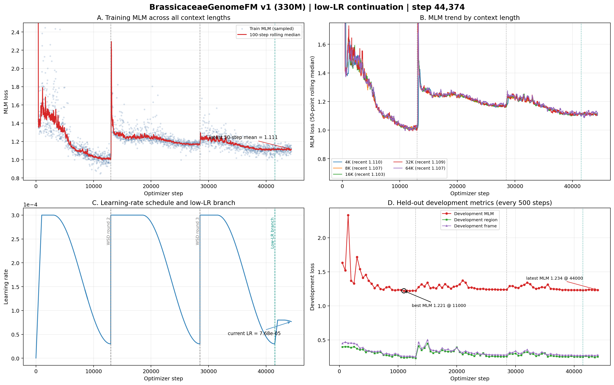

# BrassicaceaeGenomeFM — 十字花科基因组基础模型

## 当前状态

| 项目 | 状态 |
|------|------|
| 模型 | BrassiCaduceus ~330M（Bi-Mamba2 + tied embedding） |
| 训练 | **已按新策略重启** — 从 step 41,500 分支，旧高学习率运行停在 step 44,307 |
| 上下文 | 4K / 8K / 16K / 32K / 64K（128K 因 40GB 显存上限未纳入 v1） |
| 新学习率 | 当前 7.68e-5；已完成8e-5平台期，正在单向余弦衰减至1e-5；禁自动重启 |
| 开发集 MLM | 最新1.234（step 44,000）；低学习率分支5点均值1.235，全程最佳1.221（step 11,000） |
| 活跃语料覆盖 | 348.9 亿 / 1142 亿唯一 tokens（30.6%）；cycle 0、无受控复用 |
| Checkpoint | 新 lineage 已保存5个永久 checkpoint，最新 step 44,000；父 checkpoint step 41,500保留 |
| GPU | gpu10 的 GPU 0/1/2，均为 A100 40GB，当前 100% 利用率 |
| CPU Gate | 323/323 tests PASSED；新 lineage 专属 Gate 已通过 |
| 下游任务 | 32 项任务体系，12 个数据 release 已冻结（521,204 样本） |
| 公共基线 | 14 个公共 DNA-FM 权重就位于 `~/myhermes/down_model` |

## 关键参数

- 架构：21层 Bi-Mamba2, d_model=768, d_state=128, group_size=6
- 并行：FSDP (FULL_SHARD), 3 GPU, world_size=3
- 精度：bfloat16 参数+激活, float32 残差累积
- 优化器：AdamW, peak lr=3e-4, warmup=1000 steps, WSD schedule
- 每 step token 数：786,432
- gradient_accumulation=4, per_rank microbatch: 16/8/4/2/1 (4K→64K)
- RC 仅在 4K–64K 启用, fraction=0.05

## 损失函数

| 损失 | 权重 | 说明 |
|------|------|------|
| MLM | 1.0 | 15% 掩码, span+singleton |
| Region | 0.25 | 9类基因组区域分类 |
| Frame | 0.1 | 6-frame ORF 检测 |
| Boundary | 0.1 | 区域边界 token 检测 |
| RC | 0.05 | 反向互补一致性 |
| Homeolog | 0.05 | 同源基因对 InfoNCE |

## 产物路径

- 活跃训练日志：`workspace/formal_runs/brassicaceae_330m_low_lr_from_step41500_v1/training.jsonl`
- 活跃 checkpoint：`workspace/formal_runs/brassicaceae_330m_low_lr_from_step41500_v1/checkpoints/step_NNN/`
- 父 checkpoint：`workspace/formal_runs/brassicaceae_330m_formal_v1/checkpoints/step_000000041500/`
- 训练曲线：`docs/brassicaceae_genomefm_v1_training_curves_step*.png/pdf`（最新随提交更新）

## 训练进度（低学习率分支快照至 step 44,374）



### 白话解读

**A. 全部上下文的训练 MLM（左上）**
横轴是优化器步数，纵轴是 MLM loss。图只保留当前有效 lineage：旧运行保留到step 41,500，之后接低学习率分支；废弃的旧step 41,501–44,307不混入。新分支已训练2,874步，最近50步训练MLM均值为1.111，继续处于稳定低位。

**B. 五档上下文（右上）**
五条线分别对应4K、8K、16K、32K、64K。新分支最近均值分别约为1.109、1.107、1.103、1.108、1.108，五档差距小于0.01；16K略低，其余基本重合，说明调整学习率后没有牺牲某个上下文长度。

**C. 多轮 WSD 学习率（左下）**
灰色虚线是旧WSD轮次，绿色虚线是低学习率分支。学习率已按合同从3e-5平滑升到8e-5，在step 42,000–43,000保持稳定，目前进入单向余弦衰减，step 44,374为7.68e-5；后续将降至step 53,000的1e-5并保持，不再自动重启。

**D. 开发集（右下）**
新分支step 42,000–44,000的5个开发集MLM为1.232、1.238、1.236、1.232、1.234，均值1.235且没有尖峰。相同step的旧3e-4分支均值为1.298，新策略平均降低0.063（相对4.9%）；其中step 43,500从旧分支1.362降到1.232。全程最佳仍是step 11,000的1.221，因此新策略已证明显著稳定，但尚未刷新最佳值。

### 当前判断

- **运行层面健康**：新分支已连续完成2,874个优化器步，3个FSDP rank存活，三张A100均为100%，无失败标记。
- **策略调整有效**：与相同父checkpoint、相同step的旧高学习率分支相比，开发集均值改善4.9%，并消除了最高达1.362的重启尖峰。
- **科学判断**：低学习率策略解决了泛化不稳定问题，但最新1.234仍未超过全程最佳1.221；应继续观察余弦衰减阶段，不能提前宣布产生新最佳checkpoint。

- CPU Gate：`workspace/release/formal_cpu_gate_low_lr_from_step41500_v1/`

## 启动命令

```bash
cd /home/user/zhangzhishuai/myhermes/Brassicaceae_genomemodel
CUDA_VISIBLE_DEVICES=0,1,2 PYTHONPATH=workspace/code \
python workspace/code/formal_launcher.py \
  --run-contract workspace/config/formal_run_low_lr_from_step41500_v1.json \
  --checkpoint-group-size 6 \
  --distributed-mode fsdp \
  --resume workspace/formal_runs/brassicaceae_330m_formal_v1/checkpoints/step_000000041500 \
  --authorize-gpu-launch I_AUTHORIZE_3XA100_FORMAL_TRAINING
```

## 训练集

- 66个十字花科 genome assembly
- 不含放回抽样, cycle 0
- cluster-aware split (train/development)
- 5个上下文长度的 token 比例: 4K=10%, 8K=20%, 16K=21%, 32K=27%, 64K=22%
