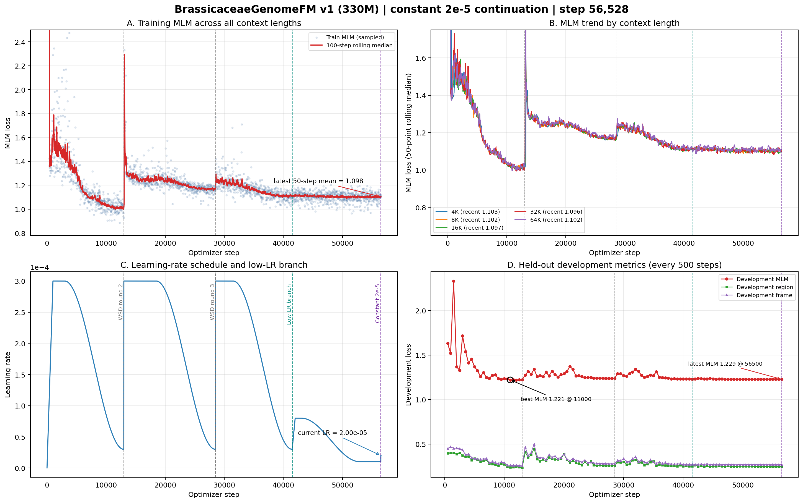

# BrassicaceaeGenomeFM — 十字花科基因组基础模型

## 当前状态

| 项目 | 状态 |
|------|------|
| 模型 | BrassiCaduceus ~330M（Bi-Mamba2 + tied embedding） |
| 训练 | **已直接切换为恒定2e-5** — 从step 56,500建立第三条lineage |
| 上下文 | 4K / 8K / 16K / 32K / 64K（128K 因40GB显存上限未纳入v1） |
| 新学习率 | 每一步恒定2e-5；无warmup、无衰减、无自动重启、无开发集变差回退 |
| 开发集 MLM | 新lineage尚未到首次评估；父checkpoint为1.22875（step 56,500），全程最佳1.22078（step 11,000） |
| 活跃语料覆盖 | 444.5亿 / 1142亿唯一tokens（38.9%）；cycle 0、无受控复用 |
| Checkpoint | 父checkpoint step 56,500；恒定2e-5新lineage首个永久checkpoint将在step 57,000保存 |
| GPU | gpu10的GPU 0/1/2，均为A100 40GB，当前100%利用率 |
| CPU Gate | 328/328 tests PASSED；恒定2e-5新lineage专属Gate已通过 |
| 下游任务 | 32 项任务体系，12 个数据 release 已冻结（521,204 样本） |
| 公共基线 | 14 个公共 DNA-FM 权重就位于 `~/myhermes/down_model` |

## 关键参数

- 架构：21层 Bi-Mamba2, d_model=768, d_state=128, group_size=6
- 并行：FSDP (FULL_SHARD), 3 GPU, world_size=3
- 精度：bfloat16 参数+激活, float32 残差累积
- 优化器：AdamW, peak lr=3e-4, warmup=1000 steps, WSD schedule
- 每 step token 数：786,432
- gradient_accumulation=4, per_rank microbatch: 16/8/4/2/1 (4K→64K)
- RC 仅在 4K–64K 启用, fraction=0.05

## 损失函数

| 损失 | 权重 | 说明 |
|------|------|------|
| MLM | 1.0 | 15% 掩码, span+singleton |
| Region | 0.25 | 9类基因组区域分类 |
| Frame | 0.1 | 6-frame ORF 检测 |
| Boundary | 0.1 | 区域边界 token 检测 |
| RC | 0.05 | 反向互补一致性 |
| Homeolog | 0.05 | 同源基因对 InfoNCE |

## 产物路径

- 活跃训练日志：`workspace/formal_runs/brassicaceae_330m_constant2e5_from_step56500_v1/training.jsonl`
- 活跃checkpoint：`workspace/formal_runs/brassicaceae_330m_constant2e5_from_step56500_v1/checkpoints/step_NNN/`
- 父checkpoint：`workspace/formal_runs/brassicaceae_330m_low_lr_from_step41500_v1/checkpoints/step_000000056500/`
- 上一分支checkpoint：`workspace/formal_runs/brassicaceae_330m_formal_v1/checkpoints/step_000000041500/`
- 训练曲线：`docs/brassicaceae_genomefm_v1_training_curves_step*.png/pdf`（最新随提交更新）

## 训练进度（恒定2e-5分支快照至step 56,528）



### 白话解读

**A. 全部上下文的训练 MLM（左上）**
当前曲线由三段有效lineage拼接：原始训练到step 41,500、单向低学习率分支到step 56,500、恒定2e-5分支从step 56,501开始。新分支目前有28步，训练MLM连续且没有异常跳变，但样本仍太少，暂不能判断提升效果。

**B. 五档上下文（右上）**
紫色恒定2e-5分支线之后，4K–64K均已出现连续训练点，没有某一长度单独发散；但新分支每档点数仍很少，图例中的最近均值主要反映step 56,500之前的低学习率阶段。

**C. 多轮 WSD 学习率（左下）**
绿色线是step 41,500的单向低学习率分支；紫色线是step 56,500的新恒定2e-5分支。新lineage从父checkpoint的1e-5直接切到2e-5，从step 56,501开始每一步都严格保持2e-5；没有warmup、衰减、自动重启或开发集触发回退。

**D. 开发集（右下）**
紫色分支当前尚未到step 57,000，因此还没有恒定2e-5下的新开发集点。图中最新1.22875仍是父lineage的step 56,500结果；必须等step 57,000及后续固定评估后，才能判断把学习率提高一倍是否真正改善泛化。

### 当前判断

- **恢复闭环**：step 56,500模型、812项优化器状态、sampler/token账本和3份rank RNG完整迁移到新lineage。
- **运行层面健康**：已连续验证至少10个新优化器步，每一步学习率均为2e-5；3个rank绑定正确GPU UUID，三卡100%，无失败标记。
- **科学判断待定**：当前只证明了恒定2e-5执行正确，尚无新开发集结果；按用户要求不会因开发集变差自动降回1e-5。

- CPU Gate：`workspace/release/formal_cpu_gate_constant2e5_from_step56500_v1/`

## 启动命令

```bash
cd /home/user/zhangzhishuai/myhermes/Brassicaceae_genomemodel
CUDA_VISIBLE_DEVICES=0,1,2 PYTHONPATH=workspace/code \
python workspace/code/formal_launcher.py \
  --run-contract workspace/config/formal_run_constant2e5_from_step56500_v1.json \
  --checkpoint-group-size 6 \
  --distributed-mode fsdp \
  --resume workspace/formal_runs/brassicaceae_330m_low_lr_from_step41500_v1/checkpoints/step_000000056500 \
  --authorize-gpu-launch I_AUTHORIZE_3XA100_FORMAL_TRAINING
```

## 训练集

- 66个十字花科 genome assembly
- 不含放回抽样, cycle 0
- cluster-aware split (train/development)
- 5个上下文长度的 token 比例: 4K=10%, 8K=20%, 16K=21%, 32K=27%, 64K=22%
