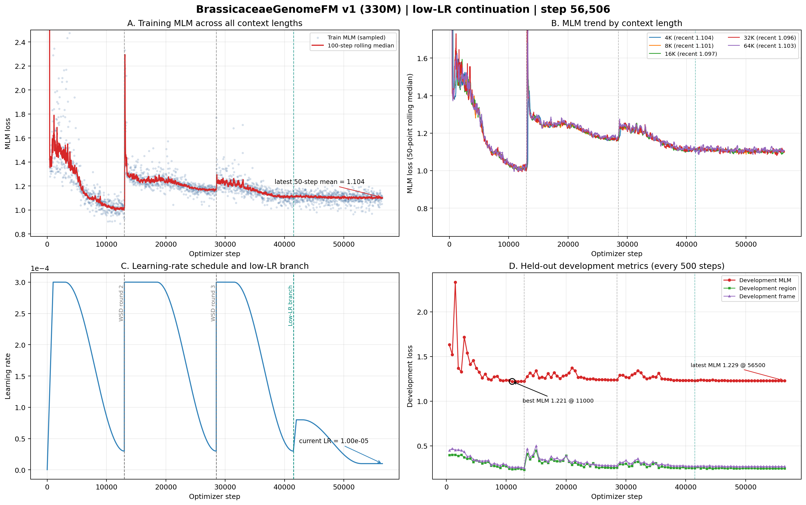

# BrassicaceaeGenomeFM — 十字花科基因组基础模型

## 当前状态

| 项目 | 状态 |
|------|------|
| 模型 | BrassiCaduceus ~330M（Bi-Mamba2 + tied embedding） |
| 训练 | **已按新策略重启** — 从 step 41,500 分支，旧高学习率运行停在 step 44,307 |
| 上下文 | 4K / 8K / 16K / 32K / 64K（128K 因 40GB 显存上限未纳入 v1） |
| 新学习率 | 已在step 53,000降至最终1e-5；此后保持1e-5，禁自动重启 |
| 开发集 MLM | 最新1.229（step 56,500）；1e-5阶段8点均值1.22866，全程最佳1.221（step 11,000） |
| 活跃语料覆盖 | 444.3 亿 / 1142 亿唯一 tokens（38.9%）；cycle 0、无受控复用 |
| Checkpoint | 新 lineage 已保存30个永久 checkpoint，最新 step 56,500；父 checkpoint step 41,500保留 |
| GPU | gpu10 的 GPU 0/1/2，均为 A100 40GB，当前 100% 利用率 |
| CPU Gate | 323/323 tests PASSED；新 lineage 专属 Gate 已通过 |
| 下游任务 | 32 项任务体系，12 个数据 release 已冻结（521,204 样本） |
| 公共基线 | 14 个公共 DNA-FM 权重就位于 `~/myhermes/down_model` |

## 关键参数

- 架构：21层 Bi-Mamba2, d_model=768, d_state=128, group_size=6
- 并行：FSDP (FULL_SHARD), 3 GPU, world_size=3
- 精度：bfloat16 参数+激活, float32 残差累积
- 优化器：AdamW, peak lr=3e-4, warmup=1000 steps, WSD schedule
- 每 step token 数：786,432
- gradient_accumulation=4, per_rank microbatch: 16/8/4/2/1 (4K→64K)
- RC 仅在 4K–64K 启用, fraction=0.05

## 损失函数

| 损失 | 权重 | 说明 |
|------|------|------|
| MLM | 1.0 | 15% 掩码, span+singleton |
| Region | 0.25 | 9类基因组区域分类 |
| Frame | 0.1 | 6-frame ORF 检测 |
| Boundary | 0.1 | 区域边界 token 检测 |
| RC | 0.05 | 反向互补一致性 |
| Homeolog | 0.05 | 同源基因对 InfoNCE |

## 产物路径

- 活跃训练日志：`workspace/formal_runs/brassicaceae_330m_low_lr_from_step41500_v1/training.jsonl`
- 活跃 checkpoint：`workspace/formal_runs/brassicaceae_330m_low_lr_from_step41500_v1/checkpoints/step_NNN/`
- 父 checkpoint：`workspace/formal_runs/brassicaceae_330m_formal_v1/checkpoints/step_000000041500/`
- 训练曲线：`docs/brassicaceae_genomefm_v1_training_curves_step*.png/pdf`（最新随提交更新）

## 训练进度（低学习率分支快照至 step 56,506）



### 白话解读

**A. 全部上下文的训练 MLM（左上）**
横轴是优化器步数，纵轴是MLM loss。当前有效lineage已从step 41,500连续训练15,006步；最近50步均值1.104，五档训练曲线在1.10附近进入平台。训练仍稳定，但下降幅度已经很小。

**B. 五档上下文（右上）**
五档最近50点均值分别为4K 1.103、8K 1.103、16K 1.098、32K 1.097、64K 1.101，差距约0.006；32K/16K略低，长上下文仍然稳定，没有出现长度退化。

**C. 多轮 WSD 学习率（左下）**
绿色分支从step 41,500启动，学习率先升到8e-5，再单向余弦衰减；step 53,000已到最终1e-5，之后3,500余步始终保持1e-5且不会重启。调度策略已经完整走完。

**D. 开发集（右下）**
低学习率分支已完成30次固定开发集评估。step 53,000进入1e-5后8个点的均值为1.22866、标准差仅0.000063，范围1.22856–1.22875；最新step 56,500为1.22875。曲线已经高度平台化，仍未超过全程最佳step 11,000的1.22078。

### 当前判断

- **运行层面健康**：低学习率分支已连续完成15,006个优化器步，3个FSDP rank和三张A100保持满载，无失败标记。
- **策略调整已完成目标**：高学习率重启尖峰被消除，开发集在1.2286附近稳定收敛，五档上下文无退化。
- **继续/停止判断**：学习率已到最终值且开发集连续8点无实质改善，边际收益基本耗尽。从科学和算力性价比看，step 56,500已是合适停止点；在未收到停止指令前训练仍继续运行。

- CPU Gate：`workspace/release/formal_cpu_gate_low_lr_from_step41500_v1/`

## 启动命令

```bash
cd /home/user/zhangzhishuai/myhermes/Brassicaceae_genomemodel
CUDA_VISIBLE_DEVICES=0,1,2 PYTHONPATH=workspace/code \
python workspace/code/formal_launcher.py \
  --run-contract workspace/config/formal_run_low_lr_from_step41500_v1.json \
  --checkpoint-group-size 6 \
  --distributed-mode fsdp \
  --resume workspace/formal_runs/brassicaceae_330m_formal_v1/checkpoints/step_000000041500 \
  --authorize-gpu-launch I_AUTHORIZE_3XA100_FORMAL_TRAINING
```

## 训练集

- 66个十字花科 genome assembly
- 不含放回抽样, cycle 0
- cluster-aware split (train/development)
- 5个上下文长度的 token 比例: 4K=10%, 8K=20%, 16K=21%, 32K=27%, 64K=22%
