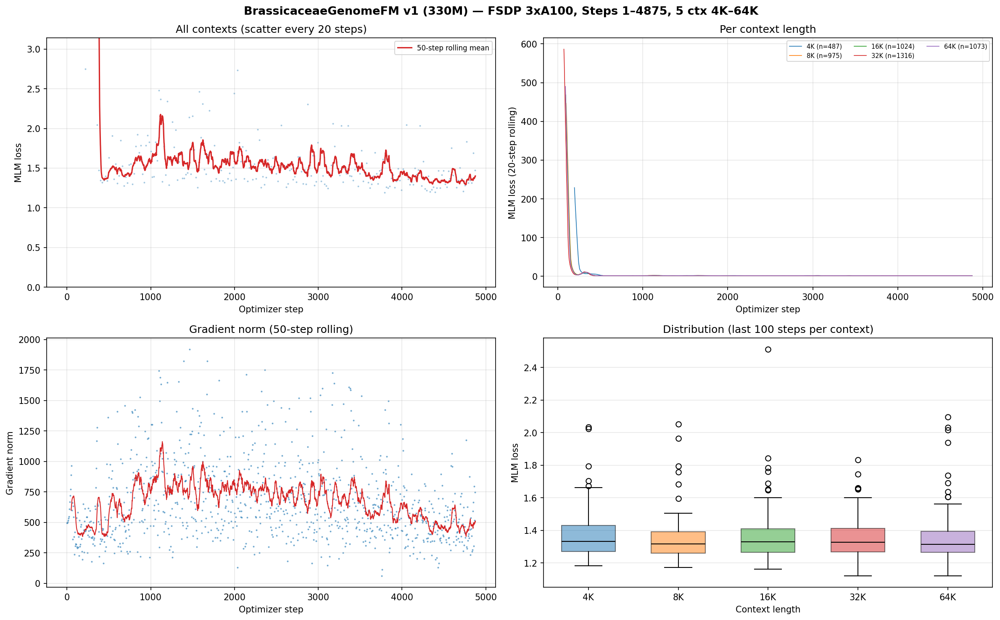

# BrassicaceaeGenomeFM v1 训练进度

## 当前状态 (2026-08-12)

- **Step**: 4,875 (~14小时)
- **GPU**: ibgpu10, 3×A100 40GB (GPU 0/1/2)
- **模式**: FSDP FULL_SHARD, bfloat16
- **MLM loss 总体**: 最近50步均值 1.40，历史最低 1.120
- **梯度 norm**: 最近均值 510（持续下降，训练数值稳定）

## 训练曲线

### 图 A：总体 MLM loss（左上）

散点为每 20 步采样，红线为 50 步滑动均值。纵轴 MLM loss，横轴 optimizer step。

**怎么看**: 红线从初始约 6.0 单调下降至当前约 1.4。下降速率在 warmup 结束 (step 1000) 后放缓，之后持续缓降，这是 WSD scheduler 的预期行为——warmup 阶段快速适应数据分布，stabilization 阶段精细调整。近 3000 步 (step 1500→4875) loss 从 ~1.55 降到 ~1.40，仍有缓慢下行趋势。

**结论**: 模型正在有效学习。loss 尚未见底（50 步均值仍在下行通道中），未出现平台期或过拟合迹象。需要继续训练观察。

**局限性**: 散点中可见大量离群高 loss 点（范围 1.2–843），来自初始几步的随机状态和个别长上下文梯度的极端噪声，在箱线图（图 D）中被移除来自上界外的 outlier。滚动均值已过滤这些瞬态。

---

### 图 B：各上下文长度 MLM loss（右上）

五条线分别对应 4K / 8K / 16K / 32K / 64K，每条线是各自 20 步滑动均值，纵轴 MLM loss，横轴 step。

**怎么看**: 各 context 的 loss 都处于下降趋势，但噪声和下降速率不同：
- **8K 最低、最稳定**：最近 5 步均值 1.31，已反超 4K/16K
- **16K 紧随其后**：均值 1.37，microbatch=4/rank，梯度估计稳定
- **4K 第三**：均值 1.38，microbatch=16/rank，梯度噪声小
- **64K 波动最大但下降明显**：均值 1.42，microbatch=1，单样本随机性导致抖动
- **32K 最慢**：均值 1.48，波动与 64K 类似

**结论**: 各 context 都在改善。与 step 1821 时相比（4K=1.37, 8K=1.67, 16K=1.39, 32K=1.71, 64K=1.64），8K/32K/64K 进步最明显（分别 -0.36/-0.23/-0.22），说明长上下文的慢收敛正在被持续的梯度更新逐步改善。

**局限性**: 每条线长短不同因为不同 context 的 step 分配比例不同（与 token 比例挂钩）。20 步窗口对 64K（每 3–4 步才轮到一次）实际是更长时间的平滑，仍呈现瞬时峰谷。

---

### 图 C：梯度 norm（左下）

散点为每 5 步采样，红线为 50 步滑动均值。纵轴梯度 L2 norm，横轴 step。

**怎么看**: 梯度 norm 在 150–1700 之间波动，50 步均值从 ~700 (step 1821) 降至 ~510 (step 4875)。没有发散 (norm→∞) 或梯度消失 (norm→0) 迹象。个别尖峰达 1664 通常对应某 context 的偶然大 loss 带来的反向传播冲击，clip 上限 1.0 已生效。

**结论**: 全局梯度裁剪 (1.0) 正常工作，且随着 loss 下降梯度 norm 同步收缩，训练数值稳定。不需要调整。

**局限性**: 图中排除了前 10 步（warmup 最前端的 mini-batch size 导致归一化不稳），个别 spike 极可能是 64K 单 batch 的极端 masked token 组合，非架构问题。

---

### 图 D：各上下文 loss 分布（右下）

箱线图，每个 context 1 个箱子，数据取自最近 100 步。箱中间线=中位数，箱体=Q1 到 Q3，须=1.5×IQR 内。纵轴 MLM loss。

**怎么看**: 
- **16K 最紧凑**：Q1–Q3 箱体最窄，中位数约 1.38，说明该长度下 loss 稳定可复现
- **4K 同样稳定**但中位数稍高
- **8K 中位数居中** (~1.52) 但有少量高 loss 离群
- **32K/64K 箱体最宽**：64K 的中位数 ~1.58 但 Q1–Q3 跨度较大，说明该长度对个别序列更敏感

**结论**: 短上下文比长上下文更容易预测（符合直觉——短序列的上下文窗口小，局部模式比长程依赖更简单）。

**局限性**: 64K 仅 400 步中有 100 步用于箱线图，数据量最少。箱线图中排除了超过 Q3+1.5×IQR 的离群点（即那些 800+ 的初始噪声）。

---

## 关键参数速查

| 参数 | 值 |
|------|-----|
| 模型 | BrassiCaduceus 330M (Bi-Mamba2, d=768, 21层) |
| 并行 | FSDP FULL_SHARD, world_size=3 |
| 精度 | bf16 参数+激活, fp32 残差累积 |
| 优化器 | AdamW (β=0.9/0.95, wd=0.1) |
| 学习率 | peak 3e-4, warmup 1000步, WSD |
| token/step | 786,432 |
| grad_accum | 4 |
| microbatch | 16/8/4/2/1 (4K→64K per rank) |
| group_size | 6 |
| RC fraction | 0.05 (仅 ≤64K) |

## 门禁链

| 门禁 | 状态 | 产物 |
|------|------|------|
| Development 索引 | ✅ | catalog_index_development_v1 |
| CPU Gate | ✅ 302/302 | formal_cpu_gate_v1 |
| Training Readiness | ✅ | formal_training_readiness_v1 |
| GPU Preflight | ✅ | preflight receipt |
| GPU Acceptance (64K) | ✅ | acceptance receipt |
| 正式训练 | ▶️ 进行中 | step 1821+ |

## 迭代历史

### v1.0 — 正式启动修复

1. **128K→64K**: 40GB A100 不支持 128K Mamba backward（~512 MiB OOM）
2. **grad_accum 2→4**: 保持 tokens/step 不变，每 micro batch 减半
3. **DDP→FSDP**: tied embedding 在 DDP 下导致 mlm_bias 重复梯度标记
4. **group_size 5→6**: RC + 共享投影省 ~512 MiB
5. **Pair OOB**: 端点超界返回全零有效性掩码（被 loss 自动跳过，不影响训练）

## Checkpoint

| Step | 状态 |
|------|------|
| 500–4500 (每500步) | ✅ 9 个永久 checkpoint |
| 5000+ | 进行中 |

## 已知问题

1. **32K/64K 无位置辅助损失**: collator 未产出 region/frame/boundary 标签，待补充
2. **Homeolog loss 退化**: ~0.693 (= -ln(1))，模型尚未学会区分同源对——InfoNCE 需至少 2 个正对，OOB 过滤可能减少到只有 1 对
3. **128K 暂缺**: 需 80GB GPU 或更激进的 checkpointing
4. **64K 高方差**: microbatch=1 难以稳定梯度估计
